<div align="center">

# 🛡️ TraceGuard

### Centralized Monitoring & Observability Platform — inspired by Sentry, built for everyone.

**Collect. Correlate. Catch issues before they catch you.**

[](LICENSE)
[]()
[]()
[]()

[Problem](#-problem-statement) • [What We're Building](#-what-were-building) • [Architecture](#-architecture) • [Features](#-core-features) • [Tech Stack](#-tech-stack) • [Getting Started](#-getting-started) • [Roadmap](#-roadmap) • [Team](#-team)

</div>

---

<!-- 
  📸 ADD A SCREENSHOT / GIF OF YOUR DASHBOARD HERE
  Example:
  <p align="center">
    
  </p>
-->

## 📌 Problem Statement

Modern applications — especially microservice-based systems — generate a flood of logs and system events. When something breaks, developers end up hunting across services, files, terminals, and code paths just to find the source of the problem.

**In short:**
- 🔍 `grep -R "error"` doesn't scale as projects grow
- 🧩 App errors are hard to correlate with system issues (CPU, memory, disk, network, DNS)
- 🗂️ Logs live in silos across services, with no single source of truth
- ⏱️ Debugging becomes slow, manual, and reactive instead of proactive

**TraceGuard** solves this by building a centralized monitoring and log management platform — collecting logs, errors, metrics, and system events into one dashboard where developers can search, analyze, and act.

---

## 🚀 What We're Building

A unified observability platform for **applications** and **Linux-based infrastructure**, built from these components:

| Component | Purpose |
|---|---|
| 🖥️ Linux/System Monitoring Agent | Collects CPU, memory, disk, process, and network data |
| 📦 Technology-specific SDKs | Drop-in libraries for apps to report errors/events |
| 🌐 Event Collector REST API | Ingests events from agents and SDKs |
| ⚙️ Event Processing Engine | Parses, validates, filters, and categorizes events |
| 📬 Event Queue | Buffers events for async, reliable processing |
| 🗄️ Centralized MongoDB Storage | Stores logs, metrics, traces, and system events |
| 📊 Dashboard + REST API | Search, visualize, and monitor everything in one place |
| 🔔 Alerting & Notifications | Flags critical issues in real time |

---

## 🏗️ Architecture

```mermaid
flowchart LR
    A[App SDKs] -->|events| C[Event Collector API]
    B[Linux Monitoring Agent] -->|system metrics| C
    C --> D[Event Queue]
    D --> E[Event Processing Engine]
    E --> F[(MongoDB)]
    F --> G[Dashboard + REST API]
    E --> H[Alerting & Notifications]
    H --> I((Webhook / Email / Slack))
```



---

## ✨ Core Features

### 1. 🐞 Application Error Monitoring
Captures errors, warnings, fatal exceptions, stack traces, API/request failures, and performance events — each enriched with timestamp, service, environment, and request context.

### 2. 🐧 Linux System Monitoring
A lightweight agent tracks CPU, memory, disk, running processes, network stats, and system-level events — so app issues can be viewed alongside infrastructure health.

### 3. 🌐 Network & Infrastructure Monitoring
Detects connectivity failures, DNS resolution issues, port/connection problems, and service availability gaps.

### 4. 🕵️ Suspicious Activity Detection
Flags unusual behavior — unexpected processes, abnormal network activity, repeated failed requests, and resource spikes. *(Initial focus: detection & logging, not a full SIEM.)*

### 5. 🗂️ Centralized Log Management
All logs, errors, metrics, traces, and system/network events land in one categorized, searchable place — no more hopping between services.

### 6. ⚙️ Event Processing
A dedicated pipeline parses, validates, filters, categorizes, and flags incoming events before storage.

### 7. 📊 Monitoring Dashboard
Log & error search, live monitoring, system stats, analytics, alerts, and service-level views — all from a single UI.

### 8. 🔔 Alerts & Notifications
Critical events trigger notifications via Webhooks, Email, Slack, and more — so nobody has to babysit the dashboard.

---

## 🧰 Tech Stack

| Layer | Technology |
|---|---|
| Backend | `Node.js` / `Express` *(update if different)* |
| Database | MongoDB |
| SDKs | `packages/sdk` *(specify languages supported)* |
| Frontend/Dashboard | *(e.g. React, Next.js — update)* |
| Queue | *(e.g. Redis, RabbitMQ, Kafka — update)* |
| CI/CD | GitHub Actions (`.github/workflow`) |

---

## ⚡ Getting Started

```bash
# Clone the repository
git clone https://github.com/KurukShetra-Core/TraceGuard.git
cd TraceGuard

# Install backend dependencies
cd backend
npm install        # or pip install -r requirements.txt

# Set up environment variables
cp .env.example .env

# Run the backend
npm run dev

# (In a separate terminal) install & run the monitoring agent
cd ../packages/sdk
npm install
npm start
```

> 📖 See [`docs/packages`](docs/packages) for detailed setup of individual SDKs and agents.

---

## 🗺️ Roadmap

- [x] Problem definition & system design
- [x] Event Collector API (basic)
- [ ] Linux monitoring agent
- [ ] Event processing & queue integration
- [ ] MongoDB schema & storage layer
- [ ] Dashboard UI (search, live monitoring, analytics)
- [ ] Alerting integrations (Webhook, Email, Slack)
- [ ] Suspicious activity detection module

---

## 👥 Team

| Name | Role | GitHub |
|---|---|---|
| Vaishnavi Shinde | Database | [@Vaishnavi482](https://github.com/Vaishnavi482) |
| Siddharth Kapadane | Frontend | [@siddharthkapadne](https://github.com/siddharthkapadne777) |
| Shivraj Jagtap | System Architecture| [@shivraj2328](https://github.com/shivraj2328) |
| Fatima Shaikh | Backend | [@FatimaNShaikh](https://github.com/FatimaNShaikh) |

---

## 🤝 Contributing

Contributions, issues, and feature requests are welcome! Feel free to check the [issues page](https://github.com/KurukShetra-Core/TraceGuard/issues).

## 📄 License

This project is licensed under the MIT License — see the [LICENSE](LICENSE) file for details.

---

<div align="center">

Made with ❤️ by **TraceOps** for the hackathon.

</div>
